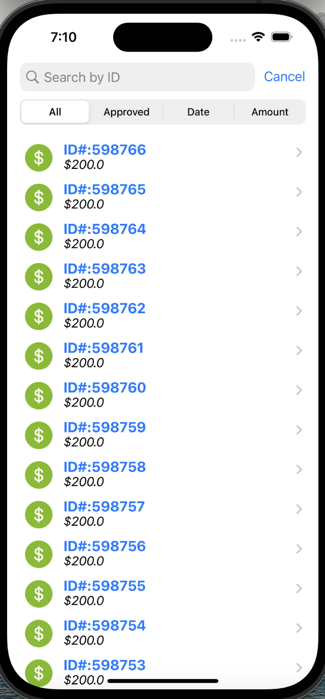

## PAGUELO-FACIL-TEST

## Requisitos
- Xcode 13+
- iOS 13+

#### FUNCIONAMIENTO DE LOS FILTROS
&nbsp;
  
<ul>
    <li>Para habilitar las opciones debajo de la barra de búsqueda, es necesario tipear algún caracter en la misma</li>
    <li>La barra de búsqueda permite filtrar por ID(coincidencia exacta)</li>
    <li>La opción del menú <b>All</b> contendrá todas las transacciones sin fitrar</li>
    <li>La opción del menú <b>Approved</b> contendrá todas las transacciones aprobadas</li>
    <li>La opción del menú <b>Date</b> filtrará por fecha de creación en orden descendente</li>
    <li>La opción del menú <b>Amount</b> filtrará por monto en orden ascendente</li>
    <li>En cualquiera de las opciones anteriormente mencionadas, es posible filtrar por ID</li>
</ul>
